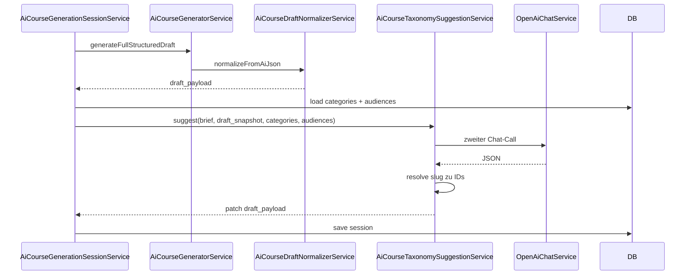

# Plan: KI-gestützte Hauptkategorie & Zielgruppen (zweiter API-Call)

## Ziel

Nach dem **ersten** erfolgreichen KI-Gesamtentwurf (`generateFullStructuredDraft`) soll ein **zusätzlicher, getrennter OpenAI-Aufruf** alle im System hinterlegten **Kategorien** und **Zielgruppen** (inkl. Slug/Name, optional Hierarchie bei Kategorien) an die KI geben. Die KI wählt passende Einträge aus; das Ergebnis wird in `draft_payload` gemappt (`primary_category_id`, `audience_ids`), sodass im Wizard **Basiseinstellungen** Dropdowns **bereits sinnvoll vorausgewählt** sind.

**Nutzer-Entscheidung:** Der Taxonomie-Call läuft **nur einmal direkt nach dem ersten KI-Entwurf** (nicht bei jedem Speichern), um Kosten/Latenz zu begrenzen.

## Nicht-Ziele (explizit)

- Keine automatische **Neuanlage** von Kategorien/Zielgruppen in der DB ohne Nutzerbestätigung (wenn keine passende Zeile existiert: **Vorschlagstext** in `draft_payload`, z. B. `ai_taxonomy_notes`, keine blinden `INSERT`s).
- Kein Ersatz für manuelle Korrektur: Nutzer kann im Wizard weiterhin ändern.

## Architektur

### Datenfluss

### Neuer Service

- **`AiCourseTaxonomySuggestionService`** (oder ähnlicher Name):
  - Input: `brief`, relevante `draft_payload`-Felder (Titel, Kurztext, …), `Collection`/`array` aller Kategorien (mind. `id`, `name`, `slug`, optional `parent_id`), alle Zielgruppen (`id`, `name`, `slug`).
  - Prompt: striktes JSON-Output mit z. B. `primary_category_slug` (nullable), `audience_slugs` (string[]), optional `confidence`, `rationale` (string, nur Admin).
  - Validierung: nur Slugs, die **existieren**, werden übernommen; unbekannte Slugs ignorieren + `ai_taxonomy_warnings` setzen.
  - Wenn keine sichere Zuordnung: leer lassen + kurze Begründung im JSON für UI.

### Integration

- **`AiCourseGenerationSessionService::runInitialAiGeneration`** (oder direkt nach erfolgreichem Draft in `AiCourseGeneratorController` / Service, wo heute der erste Lauf endet):
  - Nach `draft_payload` setzen: `TaxonomySuggestionService::applyToDraft($session)` aufrufen.
  - Merge: `primary_category_id` nur setzen, wenn noch null oder explizit überschrieben werden soll (Policy: **nur setzen wenn noch leer** ODER immer KI überschreiben – Default: **nur wenn leer**, damit manuelle Prompts nicht zerstört werden; bei reinem KI-Flow ist es leer).

### `draft_payload`-Felder (Erweiterung)

- `primary_category_id` / `audience_ids` (bestehend) – gesetzt.
- Optional: `ai_taxonomy_rationale` (string), `ai_taxonomy_source` = `openai_match_v1`.

### UI ([`wizard.blade.php`](resources/views/admin/courses/ai-generation/wizard.blade.php))

- Keine große Neugestaltung: Selects bleiben; **Werte sind vorausgefüllt** aus dem Merge.
- Optional kleiner Hinweistext unter Hauptkategorie/Zielgruppen: „Vorschlag aus KI-Taxonomiezuordnung“ (falls gesetzt).

### Tests

- Feature-Test mit `Http::fake`: erster Call liefert Draft, zweiter Call liefert JSON mit gültigem Slug → `primary_category_id` gesetzt.

## Abgrenzung zu früherem „bei Speichern“-Wunsch

Der Nutzer wählte **nicht** „bei jedem Speichern“. Der Plan sieht **keinen** zweiten Taxonomie-Call auf PATCH vor. Optional später: Button „Zuordnung erneut abfragen“.

## Betroffene Dateien (geplant)

- Neu: `app/Domain/CourseCatalog/Services/AiCourseTaxonomySuggestionService.php`
- Anpassen: `app/Domain/CourseCatalog/Services/AiCourseGenerationSessionService.php`
- Anpassen: ggf. `app/Domain/CourseCatalog/Services/AiCourseGeneratorService.php` (nur wenn Orchestrierung dort besser liegt)
- Tests: `tests/Feature/Admin/AiCourseGenerationTest.php`
- Kurz: `docs/architecture/data-model.md` (Session-Felder)

## Offene Feinheit (Default im Code)

- **Überschreiben:** Wenn `primary_category_id` aus dem ersten Draft-JSON schon gesetzt ist, **nicht** überschreiben (außer Produkt entscheidet anders).

## Umsetzung

Ausführen im **Agent-Modus** (Plan-Modus blockiert Dateiänderungen).
